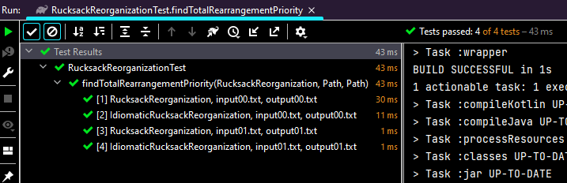

# Puzzlers
This repository contains a set of programming puzzles that are solved using Java or Kotlin programming language.
Tests provided for every problem.

## Project structure

The project directory structure is as follows:

    .
    ├── src/main                                  # Source files
    │   ├── java                                  # Java sources
    │   ├── kotlin                                # Kotlin sources
    ├── src/test                                  # Test files
    │   ├── resources/.../*tested-class-name*/    # Tested class resources (input and output files)
    ├── LICENSE
    └── README.md

### Test source

[TestSource](src/test/java/io/github/chizganov/puzzlers/util/TestSource.java) annotation and
[TestSourceProvider](src/test/java/io/github/chizganov/puzzlers/util/TestSourceProvider.java) are junit's
ArgumentProvider implementation
that search for the test resources (input and output files) in the directory structure, the same as test(ed) class
package.
Allows to test different class implementations (solutions to the problem) for every input-output pair file as in the
code snippet below:

```kotlin
@ParameterizedTest
@TestSource(
    value = RucksackReorganization::class, // used as single implementation if no custom implementations provided.
    implementations = [RucksackReorganization::class, IdiomaticRucksackReorganization::class]
)
fun findTotalRearrangementPriority(rucksackReorganization: RucksackReorganization, input: Path, output: Path)
```

With execution of 4 tests for 2 implementations and 2 input-output pairs.


## Advent of Code 2022

[Advent of Code 2022](https://adventofcode.com/2022) challenge.

| Day | Problem                                                        | Solution                                                                                                                   |
|-----|----------------------------------------------------------------|----------------------------------------------------------------------------------------------------------------------------|
| 1   | [Calorie Counting](https://adventofcode.com/2022/day/1)        | [CalorieCounting.kt](src/main/kotlin/io/github/chizganov/puzzlers/adventofcode/twentytwo/CalorieCounting.kt)               |
| 2   | [Rock Paper Scissors](https://adventofcode.com/2022/day/2)     | [RockPaperScissors.kt](src/main/kotlin/io/github/chizganov/puzzlers/adventofcode/twentytwo/RockPaperScissors.kt)           |
| 3   | [Rucksack Reorganization](https://adventofcode.com/2022/day/3) | [RucksackReorganization.kt](src/main/kotlin/io/github/chizganov/puzzlers/adventofcode/twentytwo/RucksackReorganization.kt) |
| 4   | [Camp of Cleanup](https://adventofcode.com/2022/day/4)         | [CampCleanup.kt](src/main/kotlin/io/github/chizganov/puzzlers/adventofcode/twentytwo/CampCleanup.kt)                       |
| 5   | [Supply Stacks](https://adventofcode.com/2022/day/5)           | [SupplyStacks.kt](src/main/kotlin/io/github/chizganov/puzzlers/adventofcode/twentytwo/SupplyStacks.kt)                     |
| 6   | [Tuning Trouble](https://adventofcode.com/2022/day/6)          | [TuningTrouble.kt](src/main/kotlin/io/github/chizganov/puzzlers/adventofcode/twentytwo/TuningTrouble.kt)                   |
| 7   | [No Space Left On Device](https://adventofcode.com/2022/day/7) | [DeviceSpace.kt](src/main/kotlin/io/github/chizganov/puzzlers/adventofcode/twentytwo/DeviceSpace.kt)                       |

## Leetcode

The following challenges from the [Leetcode](https://leetcode.com/).

### May LeetCoding Challenge

[May LeetCoding](https://leetcode.com/explore/featured/card/may-leetcoding-challenge/) consists of 31 daily problems
over May. Beginner-friendly.

| Day | Problem                                                                                                                                                         | Solution                                                                                                                             |
|-----|-----------------------------------------------------------------------------------------------------------------------------------------------------------------|--------------------------------------------------------------------------------------------------------------------------------------|
| 1   | [First Bad Version](https://leetcode.com/explore/featured/card/may-leetcoding-challenge/534/week-1-may-1st-may-7th/3316/)                                       | [FirstBadVersion.java](src/main/java/io/github/chizganov/puzzlers/leetcode/may/FirstBadVersion.java)                                 |
| 2   | [Jewels And Stones](https://leetcode.com/explore/featured/card/may-leetcoding-challenge/534/week-1-may-1st-may-7th/3317/)                                       | [JewelsAndStones.java](src/main/java/io/github/chizganov/puzzlers/leetcode/may/JewelsAndStones.java)                                 |
| 3   | [Ransom Note](https://leetcode.com/explore/featured/card/may-leetcoding-challenge/534/week-1-may-1st-may-7th/3318/)                                             | [RansomNote.java](src/main/java/io/github/chizganov/puzzlers/leetcode/may/RansomNote.java)                                           |
| 4   | [Number Complement](https://leetcode.com/explore/featured/card/may-leetcoding-challenge/534/week-1-may-1st-may-7th/3319/)                                       | [NumberComplement.java](src/main/java/io/github/chizganov/puzzlers/leetcode/may/NumberComplement.java)                               |
| 5   | [First Unique Character in a String](https://leetcode.com/explore/featured/card/may-leetcoding-challenge/534/week-1-may-1st-may-7th/3320/)                      | [FirstUniqueChar.java](src/main/java/io/github/chizganov/puzzlers/leetcode/may/FirstUniqueChar.java)                                 |
| 6   | [Majority Element](https://leetcode.com/explore/featured/card/may-leetcoding-challenge/534/week-1-may-1st-may-7th/3321/)                                        | [MajorityElement.java](src/main/java/io/github/chizganov/puzzlers/leetcode/may/MajorityElement.java)                                 |
| 7   | [Cousins in Binary Tree](https://leetcode.com/explore/featured/card/may-leetcoding-challenge/534/week-1-may-1st-may-7th/3322/)                                  | [CousinsInBinaryTree.java](src/main/java/io/github/chizganov/puzzlers/leetcode/may/CousinsInBinaryTree.java)                         |
| 8   | [Check If It Is a Straight Line](https://leetcode.com/explore/featured/card/may-leetcoding-challenge/535/week-2-may-8th-may-14th/3323/)                         | [CheckStraightLine.java](src/main/java/io/github/chizganov/puzzlers/leetcode/may/CheckStraightLine.java)                             |
| 9   | [Valid Perfect Square](https://leetcode.com/explore/featured/card/may-leetcoding-challenge/535/week-2-may-8th-may-14th/3324/)                                   | [ValidPerfectSquare.java](src/main/java/io/github/chizganov/puzzlers/leetcode/may/ValidPerfectSquare.java)                           |
| 10  | [Find the Town Judge](https://leetcode.com/explore/challenge/card/may-leetcoding-challenge/535/week-2-may-8th-may-14th/3325/)                                   | [FindTownJudge.java](src/main/java/io/github/chizganov/puzzlers/leetcode/may/FindTownJudge.java)                                     |
| 11  | [Flood Fill](https://leetcode.com/explore/challenge/card/may-leetcoding-challenge/535/week-2-may-8th-may-14th/3326/)                                            | [FloodFill.java](src/main/java/io/github/chizganov/puzzlers/leetcode/may/FloodFill.java)                                             |
| 12  | [Single Element in a Sorted Array](https://leetcode.com/explore/challenge/card/may-leetcoding-challenge/535/week-2-may-8th-may-14th/3327/)                      | [SingleElementInSortedArray.java](src/main/java/io/github/chizganov/puzzlers/leetcode/may/SingleElementInSortedArray.java)           |
| 13  | [Remove K Digits](https://leetcode.com/explore/challenge/card/may-leetcoding-challenge/535/week-2-may-8th-may-14th/3328/)                                       | [RemoveDigits.java](src/main/java/io/github/chizganov/puzzlers/leetcode/may/RemoveDigits.java)                                       |
| 14  | [Implement Trie (Prefix Tree)](https://leetcode.com/explore/challenge/card/may-leetcoding-challenge/535/week-2-may-8th-may-14th/3329/)                          | [Trie.java](src/main/java/io/github/chizganov/puzzlers/leetcode/may/Trie.java)                                                       |
| 15  | [Maximum Sum Circular Subarray](https://leetcode.com/explore/challenge/card/may-leetcoding-challenge/536/week-3-may-15th-may-21st/3330/)                        | [MaxSumCircularSubarray.java](src/main/java/io/github/chizganov/puzzlers/leetcode/may/MaxSumCircularSubarray.java)                   |
| 16  | [Odd Even Linked List](https://leetcode.com/explore/challenge/card/may-leetcoding-challenge/536/week-3-may-15th-may-21st/3331/)                                 | [OddEvenLinkedList.java](src/main/java/io/github/chizganov/puzzlers/leetcode/may/OddEvenLinkedList.java)                             |
| 17  | [Find All Anagrams in a String](https://leetcode.com/explore/challenge/card/may-leetcoding-challenge/536/week-3-may-15th-may-21st/3332/)                        | [FindAllAnagrams.java](src/main/java/io/github/chizganov/puzzlers/leetcode/may/FindAllAnagrams.java)                                 |
| 18  | [Permutation in String](https://leetcode.com/explore/challenge/card/may-leetcoding-challenge/536/week-3-may-15th-may-21st/3333/)                                | [PermutationInString.java](src/main/java/io/github/chizganov/puzzlers/leetcode/may/PermutationInString.java)                         |
| 19  | [Online Stock Span](https://leetcode.com/explore/challenge/card/may-leetcoding-challenge/536/week-3-may-15th-may-21st/3334/)                                    | [StockSpanner.java](src/main/java/io/github/chizganov/puzzlers/leetcode/may/StockSpanner.java)                                       |
| 20  | [Kth Smallest Element in a BST](https://leetcode.com/explore/challenge/card/may-leetcoding-challenge/536/week-3-may-15th-may-21st/3335/)                        | [KthSmallestElementInBst.java](src/main/java/io/github/chizganov/puzzlers/leetcode/may/KthSmallestElementInBst.java)                 |
| 21  | [Count Square Submatrices with All Ones](https://leetcode.com/explore/challenge/card/may-leetcoding-challenge/536/week-3-may-15th-may-21st/3336/)               | [CountSquareSubmatrices.java](src/main/java/io/github/chizganov/puzzlers/leetcode/may/CountSquareSubmatrices.java)                   |
| 22  | [Sort Characters By Frequency](https://leetcode.com/explore/challenge/card/may-leetcoding-challenge/537/week-4-may-22nd-may-28th/3337/)                         | [SortCharactersByFrequency.java](src/main/java/io/github/chizganov/puzzlers/leetcode/may/SortCharactersByFrequency.java)             |
| 23  | [Interval List Intersections](https://leetcode.com/explore/challenge/card/may-leetcoding-challenge/537/week-4-may-22nd-may-28th/3338/)                          | [IntervalListIntersection.java](src/main/java/io/github/chizganov/puzzlers/leetcode/may/IntervalListIntersection.java)               |
| 24  | [Construct Binary Search Tree from Preorder Traversal](https://leetcode.com/explore/challenge/card/may-leetcoding-challenge/537/week-4-may-22nd-may-28th/3339/) | [BinarySearchTreeFromPreorder.java](src/main/java/io/github/chizganov/puzzlers/leetcode/thirtyday/BinarySearchTreeFromPreorder.java) |
| 25  | [Uncrossed Lines](https://leetcode.com/explore/challenge/card/may-leetcoding-challenge/537/week-4-may-22nd-may-28th/3340/)                                      | [UncrossedLines.java](src/main/java/io/github/chizganov/puzzlers/leetcode/may/UncrossedLines.java)                                   |
| 26  | [Contiguous Array](https://leetcode.com/explore/challenge/card/may-leetcoding-challenge/537/week-4-may-22nd-may-28th/3341/)                                     | [ContiguousArray.java](src/main/java/io/github/chizganov/puzzlers/leetcode/may/ContiguousArray.java)                                 |
| 27  | [Possible Bipartition](https://leetcode.com/explore/challenge/card/may-leetcoding-challenge/537/week-4-may-22nd-may-28th/3342/)                                 | [PossibleBipartition.java](src/main/java/io/github/chizganov/puzzlers/leetcode/may/PossibleBipartition.java)                         |
| 28  | [Counting Bits](https://leetcode.com/explore/challenge/card/may-leetcoding-challenge/537/week-4-may-22nd-may-28th/3343/)                                        | [CountingBits.java](src/main/java/io/github/chizganov/puzzlers/leetcode/may/CountingBits.java)                                       |
